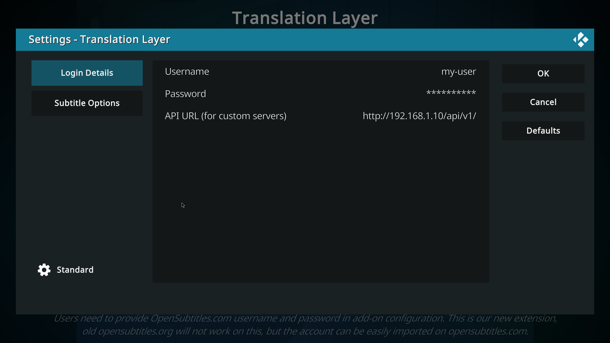
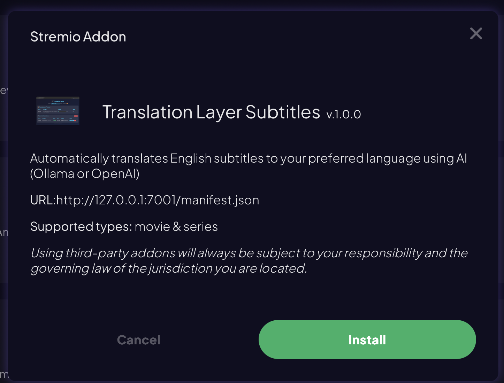

# Translation Layer

A subtitle translation service that **fetches English subtitles from OpenSubtitles.org and translates them to any popular language** using AI models running locally via **Ollama** or cloud-based via **OpenAI**.

## How It Works

```
Kodi → Translation Layer → OpenSubtitles.org (fetch English)
                        ↓
                      AI Model (Ollama or OpenAI)
                        ↓
                      Return translated subtitle to Kodi
```

1. Kodi searches for subtitles → Service fetches English from OpenSubtitles
2. User picks a subtitle → Service downloads English, translates to target language
3. Translated subtitle returned to Kodi and saved alongside the movie

## Features


- ✅ **Translates to 55 languages** including Hebrew, Arabic, Spanish, French, German, Chinese, Japanese, Hindi, and more
- ✅ **Automatic RTL support** for Hebrew, Arabic, Persian, Urdu, and Pashto
- ✅ **Multiple AI backends**: Local Ollama or cloud OpenAI
- ✅ **Settings UI**: Configure everything from the web interface
- ✅ **File Browser**: Browse NAS via SMB and translate files directly
- ✅ **Embedded subtitle detection**: Extract and translate subtitles from MKV/MP4 files
- ✅ **Hearing impaired filter**: Skip [music], [sound effects] annotations
- ✅ **Caches translations** to avoid re-translating
- ✅ **OpenSubtitles.com REST API** compatible
- ✅ **Kodi add-on** included
- ✅ **Stremio add-on** included
- ✅ Built with Spring Boot 4.0 and Spring AI 2.0

## Prerequisites

1. **Java 25** or later
2. **Ollama** installed (for local translation) OR OpenAI API key (for cloud translation)
3. **OpenSubtitles.com account** with API key

### Installing Ollama

```bash
# macOS
brew install ollama

# Start Ollama service
ollama serve

# Pull a TranslateGemma model (see Model Options below)
ollama pull translategemma:4b
```

### TranslateGemma Model Options

TranslateGemma is Google's specialized translation model based on Gemma 3. Available sizes:

| Model | Size | Storage | Best For |
|-------|------|---------|----------|
| `translategemma:4b` | 4B params | ~3.3 GB | Fast translation, mobile/laptop |
| `translategemma:12b` | 12B params | ~8.1 GB | Best quality/speed balance |
| `translategemma:27b` | 27B params | ~17 GB | Highest quality, needs powerful GPU |

**Recommendation**: Start with `translategemma:4b` for quick setup. Upgrade to `12b` for better quality if your hardware supports it.

## Quick Start

### 1. Build and Run the Application

```bash
# Build
./mvnw clean package -DskipTests

# Run
./mvnw spring-boot:run
```

The service starts on `http://localhost:8080`.

### 2. Configure Settings

On first launch, you'll see a **"Setup Required"** banner. Click **Settings** to configure:


**Required Settings:**
- **OpenSubtitles** - Enter your API key, username, and password
  - Get credentials from [opensubtitles.com/consumers](https://www.opensubtitles.com/consumers)

**AI Model Settings:**
- **Ollama** (default, local): Configure base URL and model name
  - Pull models directly from the Settings page
- **OpenAI** (cloud): Enter your API key and select model

**Translation Settings:**
- **Target Language**: Choose from 55 supported languages
- **Skip Hearing Impaired**: Filter out [music], [sound effects] annotations

**NAS Connection** (optional):
- Configure SMB/CIFS connection to browse and translate subtitles on your NAS

### 3. Using with Ollama (Recommended)

Make sure Ollama is running (`ollama serve`) with a TranslateGemma model:

```bash
# Pull a model (or use the Settings page to pull models)
ollama pull translategemma:4b
```

You can also use OpenAI by selecting it in the Settings page and entering your API key.

## Kodi Add-on Installation


A custom Kodi add-on is included that connects to your local Translation Layer service.

### Building the Add-on

1. The add-on source is in `service.subtitles.opensubtitles-translation-layer/`

2. Create a zip file for installation:
   ```bash
   cd /path/to/translation-layer
   zip -r service.subtitles.opensubtitles-translation-layer.zip \
       service.subtitles.opensubtitles-translation-layer/
   ```

### Installing in Kodi

1. Open Kodi → **Settings** → **Add-ons**
2. Select **Install from zip file**
3. Navigate to the zip file you created and select it
4. The add-on "Translation Layer" will be installed

### Configuring the Add-on

1. Go to **Add-ons** → **My add-ons** → **Subtitles** → **Translation Layer**
2. Select **Configure**
3. Set the **Translation Layer URL** to your server (default: `http://192.168.1.10:8080/api/v1` - must include the /api/v1 as expected by OpenSubtitles API)



### Important Usage Notes

> ⚠️ **First-time downloads will timeout in Kodi** - This is expected behavior!

When you download a subtitle for the first time, translation takes time (30 seconds to several minutes depending on subtitle length and model). Kodi's subtitle downloader will likely timeout before translation completes.

**Workflow:**
1. Select a subtitle in Kodi → Download starts but times out
2. Open the **web dashboard** (`http://localhost:8080`) to monitor translation progress
3. Once translation shows as "Ready", go back to Kodi and download again → Instant cached result

**Language Selection:**
- Change your target language from the **web dashboard** dropdown
- The selected language persists across restarts
- RTL languages (Hebrew, Arabic, Persian, Urdu, Pashto) are automatically handled

## Stremio Add-on



A separate Stremio add-on is included in the `stremio-addon/` folder.

### Quick Start

```bash
cd stremio-addon
npm install
npm start
```

The add-on runs on `http://localhost:7001`. To install in Stremio:
1. Open Stremio → **Add-ons**
2. Enter: `http://localhost:7001/manifest.json`
3. Click **Install**

See [stremio-addon/README.md](stremio-addon/README.md) for full documentation.

## Configuration

Configuration is managed through the **Settings page** (`http://localhost:8080/settings`). Settings are persisted in `~/.subtitle-cache/app-settings.json`.

### Settings Available

| Setting | Description |
|---------|-------------|
| **OpenSubtitles** | API key, username, and password for subtitle downloads |
| **AI Model** | Choose Ollama (local) or OpenAI (cloud) |
| **Ollama Settings** | Base URL, model name, pull new models |
| **OpenAI Settings** | API key, model selection |
| **Target Language** | Choose from 55 supported languages |
| **Hearing Impaired Filter** | Skip [music], [sound effects] annotations |
| **NAS Connection** | SMB/CIFS settings for network file browsing |

### Advanced Configuration

For advanced settings, edit `src/main/resources/application.yml`:

```yaml
server:
  port: 8080

translation:
  cache:
    enabled: true
    directory: ${HOME}/.subtitle-cache
```

## Web Pages

| URL | Description |
|-----|-------------|
| `/status` | Main dashboard - translation progress, cache management |
| `/settings` | Settings page - all configuration |
| `/browse` | File Browser - browse NAS and translate embedded subtitles |

## API Endpoints

| Endpoint | Method | Description |
|----------|--------|-------------|
| `/api/v1/subtitles` | GET | Search for subtitles (Kodi/OpenSubtitles API) |
| `/api/v1/download` | POST | Request subtitle download |
| `/api/v1/download/{id}/{file}` | GET | Download translated subtitle |
| `/api/settings` | GET/POST | Get/update settings |
| `/api/browse/list` | GET | List files on NAS |
| `/api/browse/embedded-tracks` | POST | Detect embedded subtitles |

## Project Structure

```
translation-layer/
├── src/main/java/com/example/translationlayer/
│   ├── TranslationLayerApplication.java
│   ├── config/
│   │   ├── LanguageConfig.java          # Language settings & persistence
│   │   └── WebConfig.java               # CORS configuration
│   ├── controller/
│   │   ├── AuthController.java          # OpenSubtitles auth proxy
│   │   ├── InfoController.java          # API info endpoints
│   │   ├── StatusController.java        # Web dashboard
│   │   └── SubtitleController.java      # Subtitle search/download
│   ├── model/
│   │   ├── SubtitleEntry.java           # Subtitle data model
│   │   ├── SubtitleSearchResponse.java  # Search results
│   │   └── ...                          # Other DTOs
│   └── service/
│       ├── OpenSubtitlesClient.java     # OpenSubtitles API client
│       ├── RtlTextProcessor.java        # RTL text handling
│       ├── SubtitleParser.java          # SRT/VTT parsing
│       ├── SubtitleService.java         # Main subtitle logic
│       ├── TranslationProgressTracker.java  # Progress tracking
│       └── TranslationService.java      # AI translation
├── service.subtitles.opensubtitles-translation-layer/
│   └── ...                              # Kodi add-on source
├── src/main/resources/
│   └── application.yml                  # Configuration
└── pom.xml
```

## License

Apache License 2.0
