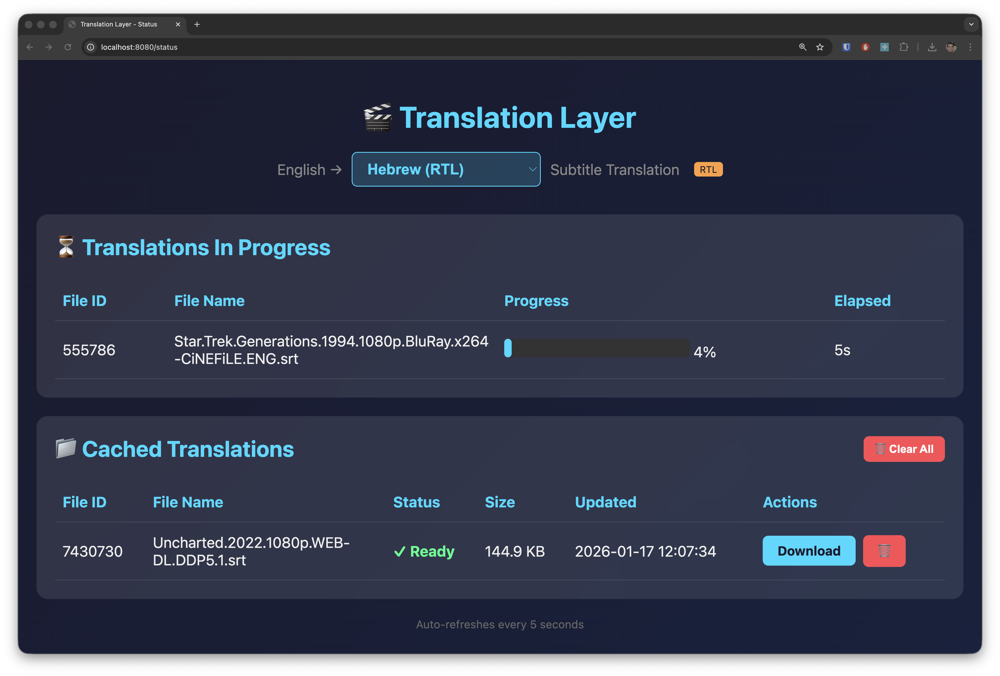
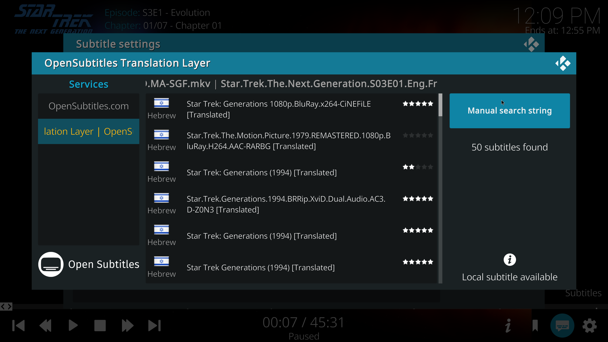

# Translation Layer

A subtitle translation service that **fetches English subtitles from OpenSubtitles.org and translates them to any popular language** using AI models running locally via **Ollama** or cloud-based via **OpenAI**.

## How It Works

```
Kodi → Translation Layer → OpenSubtitles.org (fetch English)
                        ↓
                      AI Model (Ollama or OpenAI)
                        ↓
                      Return translated subtitle to Kodi
```

1. Kodi searches for subtitles → Service fetches English from OpenSubtitles
2. User picks a subtitle → Service downloads English, translates to target language
3. Translated subtitle returned to Kodi and saved alongside the movie

## Features



- ✅ **Translates to 55 languages** including Hebrew, Arabic, Spanish, French, German, Chinese, Japanese, Hindi, and more
- ✅ **Automatic RTL support** for Hebrew, Arabic, Persian, Urdu, and Pashto
- ✅ **Multiple AI backends**: Local Ollama or cloud OpenAI
- ✅ **Caches translations** to avoid re-translating
- ✅ **Web dashboard** to monitor translation progress
- ✅ **OpenSubtitles.com REST API** compatible
- ✅ **Custom Kodi add-on** included
- ✅ Built with Spring Boot 4.0 and Spring AI 2.0

## Prerequisites

1. **Java 25** or later
2. **Ollama** installed (for local translation) OR OpenAI API key (for cloud translation)
3. **OpenSubtitles.com account** with API key

### Installing Ollama

```bash
# macOS
brew install ollama

# Start Ollama service
ollama serve

# Pull a TranslateGemma model (see Model Options below)
ollama pull translategemma:4b
```

### TranslateGemma Model Options

TranslateGemma is Google's specialized translation model based on Gemma 3. Available sizes:

| Model | Size | Storage | Best For |
|-------|------|---------|----------|
| `translategemma:4b` | 4B params | ~3.3 GB | Fast translation, mobile/laptop |
| `translategemma:12b` | 12B params | ~8.1 GB | Best quality/speed balance |
| `translategemma:27b` | 27B params | ~17 GB | Highest quality, needs powerful GPU |

**Recommendation**: Start with `translategemma:4b` for quick setup. Upgrade to `12b` for better quality if your hardware supports it.

## Quick Start

### 1. Set Environment Variables

You need an OpenSubtitles.com account and API key:
1. Create an account at [opensubtitles.com](https://www.opensubtitles.com)
2. Go to your profile → **API Consumers** → **Create new consumer**
3. Copy your API key

```bash
# Required - OpenSubtitles credentials (get API key from opensubtitles.com/consumers)
export OPEN_SUBTITLES_USERNAME="your-username"
export OPEN_SUBTITLES_PASSWORD="your-password"
export OPEN_SUBTITLES_API_KEY="your-api-key"

# Optional - Only if using OpenAI instead of Ollama
export OPENAI_API_KEY="sk-your-openai-key"

# Optional - Custom OpenAI-compatible endpoint (e.g., Tanzu Platform, Azure OpenAI)
export OPENAI_BASE_URL="https://your-custom-endpoint.com"
```

### 2. Build the Application

```bash
./mvnw clean package -DskipTests
```

### 3. Run the Application

**Using Ollama (default):**
```bash
./mvnw spring-boot:run
```

**Using OpenAI:**
```bash
SPRING_AI_MODEL_CHAT=openai ./mvnw spring-boot:run
```

The service starts on `http://localhost:8080`. Visit the web dashboard to monitor translations.

## Kodi Add-on Installation



A custom Kodi add-on is included that connects to your local Translation Layer service.

### Building the Add-on

1. The add-on source is in `service.subtitles.opensubtitles-translation-layer/`

2. Create a zip file for installation:
   ```bash
   cd /path/to/translation-layer
   zip -r service.subtitles.opensubtitles-translation-layer.zip \
       service.subtitles.opensubtitles-translation-layer/
   ```

### Installing in Kodi

1. Open Kodi → **Settings** → **Add-ons**
2. Select **Install from zip file**
3. Navigate to the zip file you created and select it
4. The add-on "Translation Layer" will be installed

### Configuring the Add-on

1. Go to **Add-ons** → **My add-ons** → **Subtitles** → **Translation Layer**
2. Select **Configure**
3. Set the **Translation Layer URL** to your server (default: `http://localhost:8080`)

### Important Usage Notes

> ⚠️ **First-time downloads will timeout in Kodi** - This is expected behavior!

When you download a subtitle for the first time, translation takes time (30 seconds to several minutes depending on subtitle length and model). Kodi's subtitle downloader will likely timeout before translation completes.

**Workflow:**
1. Select a subtitle in Kodi → Download starts but times out
2. Open the **web dashboard** (`http://localhost:8080`) to monitor translation progress
3. Once translation shows as "Ready", go back to Kodi and download again → Instant cached result

**Language Selection:**
- Change your target language from the **web dashboard** dropdown
- The selected language persists across restarts
- RTL languages (Hebrew, Arabic, Persian, Urdu, Pashto) are automatically handled

## Configuration

All configuration is in `src/main/resources/application.yml`:

```yaml
server:
  port: 8080

spring:
  ai:
    model:
      chat: ollama  # Change to 'openai' for cloud translation
    ollama:
      base-url: http://localhost:11434
      chat:
        options:
          model: translategemma:4b  # Options: 4b, 12b, 27b
          temperature: 0.2
    openai:
      api-key: ${OPENAI_API_KEY:}
      chat:
        options:
          model: gpt-4o-mini
          temperature: 0.2

opensubtitles:
  base-url: https://api.opensubtitles.com/api/v1
  username: ${OPEN_SUBTITLES_USERNAME:}
  password: ${OPEN_SUBTITLES_PASSWORD:}
  api-key: ${OPEN_SUBTITLES_API_KEY:}

translation:
  source-language: English
  target-language: Hebrew  # Changed via web dashboard
  cache:
    enabled: true
    directory: ${HOME}/.subtitle-cache
```

### Key Configuration Options

| Setting | Description |
|---------|-------------|
| `spring.ai.model.chat` | `ollama` (local) or `openai` (cloud) |
| `spring.ai.ollama.chat.options.model` | TranslateGemma model size |
| `translation.cache.directory` | Where translated subtitles are cached |

## API Endpoints

| Endpoint | Method | Description |
|----------|--------|-------------|
| `/status` | GET | Web dashboard with translation progress |
| `/api/v1/subtitles` | GET | Search for subtitles |
| `/api/v1/download` | POST | Request subtitle download |
| `/api/v1/download/{id}/{file}` | GET | Download translated subtitle |
| `/language` | POST | Change target language |

## Project Structure

```
translation-layer/
├── src/main/java/com/example/translationlayer/
│   ├── TranslationLayerApplication.java
│   ├── config/
│   │   ├── LanguageConfig.java          # Language settings & persistence
│   │   └── WebConfig.java               # CORS configuration
│   ├── controller/
│   │   ├── AuthController.java          # OpenSubtitles auth proxy
│   │   ├── InfoController.java          # API info endpoints
│   │   ├── StatusController.java        # Web dashboard
│   │   └── SubtitleController.java      # Subtitle search/download
│   ├── model/
│   │   ├── SubtitleEntry.java           # Subtitle data model
│   │   ├── SubtitleSearchResponse.java  # Search results
│   │   └── ...                          # Other DTOs
│   └── service/
│       ├── OpenSubtitlesClient.java     # OpenSubtitles API client
│       ├── RtlTextProcessor.java        # RTL text handling
│       ├── SubtitleParser.java          # SRT/VTT parsing
│       ├── SubtitleService.java         # Main subtitle logic
│       ├── TranslationProgressTracker.java  # Progress tracking
│       └── TranslationService.java      # AI translation
├── service.subtitles.opensubtitles-translation-layer/
│   └── ...                              # Kodi add-on source
├── src/main/resources/
│   └── application.yml                  # Configuration
└── pom.xml
```

## License

Apache License 2.0
